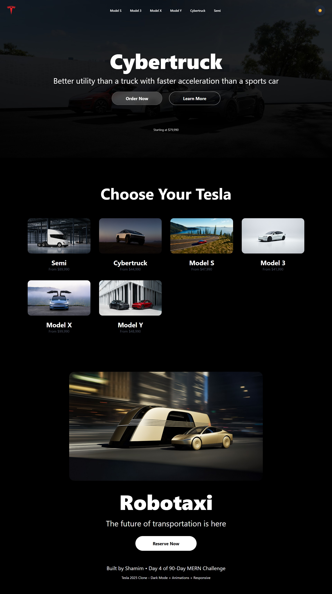
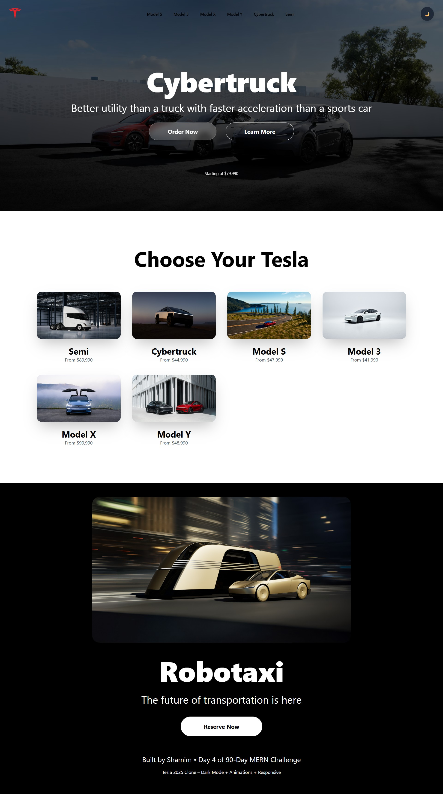

# Day 04 – Tesla 2025 Official Website Clone

**Live URL**: shamim-tesla-clone.vercel.app
**Tech Stack**: HTML • Tailwind CSS • Alpine.js (dark mode) • AOS (scroll animations)  
**Time taken**: ~9 hours

## Features
- Pixel-perfect clone of Tesla.com 2025 homepage  
- Fully responsive (mobile + desktop)  
- Working dark/light mode toggle (top-right corner)  
- Smooth scroll animations using AOS  
- Cybertruck hero section with pricing  
- Model S / 3 / X / Y showcase grid  
- Robotaxi section (2025 concept)  
- Glassmorphism buttons + hover effects  

## Screenshot

## Local Assets Used
- Tesla logo  
- Cybertruck, Model S/3/X/Y/Semi, Robotaxi images  

**Next → Day 5: Spotify Clone (with working music player)**

Built by Shamim • 90-Day MERN Challenge